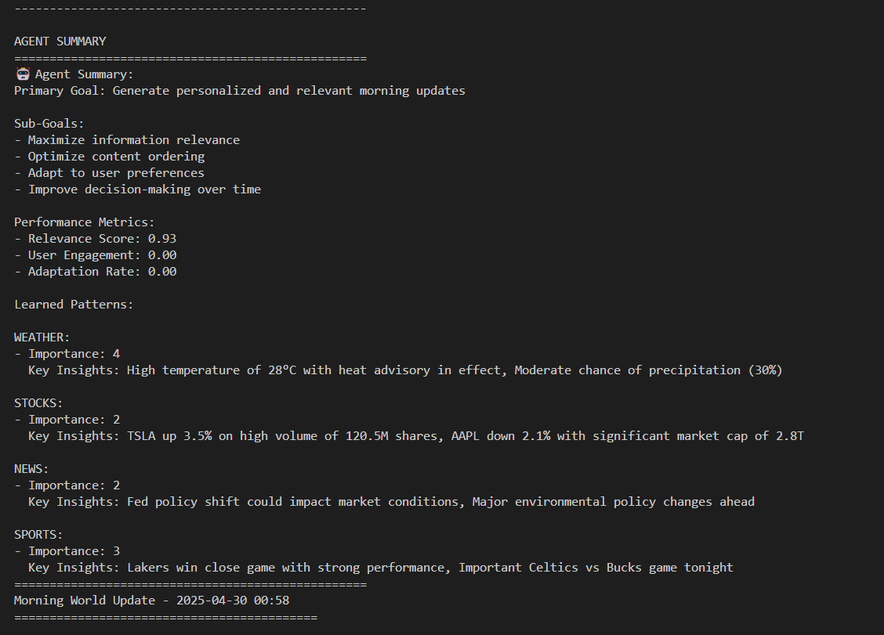

# AI-Powered Morning Update System

An intelligent system that generates personalized morning updates using AI to analyze and prioritize information from various sources including weather, stocks, news, and sports.

## 🎥 Demo Video

https://github.com/yourusername/genAIapp/assets/youruserid/video.mp4

## ✨ Features

- **Smart Priority Analysis**: AI-powered analysis of different information categories to determine their importance
- **Personalized Updates**: Customized morning reports based on your preferences and location
- **Telegram Integration**: Receive updates directly in your Telegram chat
- **Adaptive Learning**: The system learns from your interactions to improve future updates
- **Multi-source Integration**: Combines data from weather, stocks, news, and sports

## 🛠️ Installation

1. Clone the repository:
```bash
git clone https://github.com/yourusername/genAIapp.git
cd genAIapp
```

2. Create and activate a virtual environment:
```bash
python -m venv .venv
source .venv/bin/activate  # On Windows: .venv\Scripts\activate
```

3. Install dependencies:
```bash
pip install -r requirements.txt
```

4. Configure your settings in `config/config.yaml`:
```yaml
telegram:
  bot_token: "your_bot_token"
  chat_id: "your_chat_id"
api_keys:
  openai: "your_openai_api_key"
city: "Your City"
```

## 🚀 Usage

1. Run the test script to verify everything is working:
```bash
python test_morning_update.py
```

2. To schedule automatic updates, use the scheduler:
```bash
# On Windows
python src/scheduler.py

# On Linux/Mac
./run_scheduler.sh
```

## 📊 How It Works

1. **Data Collection**: The system fetches data from various sources
2. **AI Analysis**: Each category is analyzed for importance and relevance
3. **Priority Assignment**: Categories are assigned priorities (1-5, where 1 is highest)
4. **Report Generation**: A personalized report is generated with sections ordered by priority
5. **Delivery**: The report is sent to your Telegram chat

## 🤖 Agent Intelligence

The system uses an AI agent that:
- Learns from your interactions
- Adapts to your preferences
- Optimizes content ordering
- Improves decision-making over time



## 📝 Example Output

```
Morning World Update - 2025-04-30 01:04
===========================================

STOCKS Market Update:
• AAPL: $175.25 (↓3.75%)
• TSLA: $242.50 (↑8.30%)
• MSFT: $338.15 (↑2.45%)

NEWS Top Headlines:
⚠️ Fed Signals Potential Interest Rate Cut in Coming Months
  Category: Economy
• Major Tech Company Announces Revolutionary AI Chip
  Category: Technology
⚠️ Global Climate Summit Reaches Historic Agreement
  Category: Environment

SPORTS Update:
NBA:
• Lakers vs Warriors (Final)
  LeBron's triple-double leads Lakers

NFL:
• Chiefs vs Bills (Final)
  Mahomes throws 3 TDs in victory

Upcoming Games:
• Celtics vs Bucks at 7:30 PM EST
  Note: Crucial matchup for playoff seeding

WEATHER Update for San Francisco:
• Temperature: 28°C
• Conditions: partly cloudy
• Humidity: 65%
• Wind Speed: 15 m/s
• Precipitation Chance: 30%
• Alerts: Heat advisory in effect until 6 PM
```

## 🤝 Contributing

Contributions are welcome! Please feel free to submit a Pull Request. 